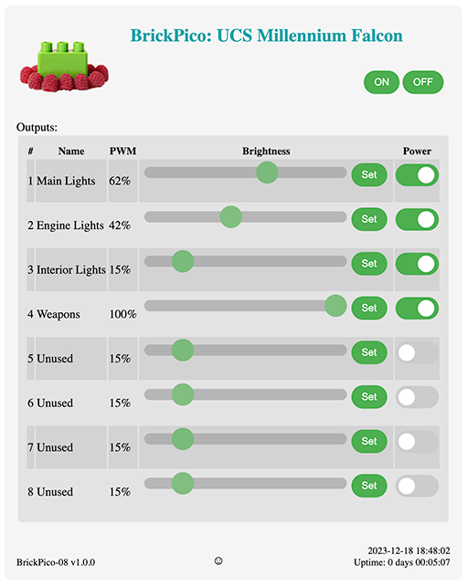

# Brickpico: Smart PWM LED Controller
[](https://github.com/tjko/brickpico/actions/workflows/cmake.yml)
[](https://github.com/tjko/brickpico/actions/workflows/codeql.yml)

Bricpico is a smart PWM LED controller based around [Raspberry Pi Pico](https://www.raspberrypi.com/documentation/microcontrollers/raspberry-pi-pico.html) (RP2040 MCU).
Brickpico is mainly meant to controlling various LED lights on LEGO models, but can be used to control any LED lights (or other small loads).

Brickpico operates as standalone controller that can be configured and left running. It does not require any drivers and doesn't care what OS is being used. BrickPico is an Open-source hardware (OSHW) project.

[](images/brickpico-08.jpg?raw=true)

## What is it for?
* Fanpico is for customizing fan "curves" to fine tune how your motherboard controlled fans run.
* Fine tuning fan speeds to easily balance airflow.
* Controlling fan based on temperature sensor input.
* Monitoring fan speeds and behaviour as well as monitoring what exactly motherboard is doing.

## Features
* Controls up to 8 to 16 separete channels (LED group)
* Adjustable output brightness (via PWM)
* Adjustable output voltage 5V or 3.3V
* Connectors for common Lego light kits (Light My Bricks, etc.)
* OLED display module support (128x64 or 128x128)
* OS Independent, no drivers or software needed.
* Configuration stored on the device itself (in the flash memory).
* SCPI "like" programming interface (see [Command Reference](commands.md))
* WiFi support if opting to mount Pico W on the board. This turns fanpico to "IoT" device with basic web interface.

### Interfaces

* Serial "Console". Primary method for configuring/monitoring FanPico units is via (USB) Serial console (some units also have 3.3V TTL Serial connection).
* Web Interface (available when using _Pico W_) over WiFi

   [](images/brickpico-web.png?raw=true)

For more documentation check [BrickPico Wiki](https://github.com/tjko/brickpico/wiki)


## Where can I get one?
Initially BrickPico will be available as a DIY kit. Initial patch of kits should be available in early January.


### DIY Option
You can upload the Kerber files (found under boards directory) to your favorite PCB maker website and get your boards produced in matter of days.
Component list (BOM or bill of materials) is found under boards directory as well along with the electrical schematics.


### Review Units
If you are member of press (or YouTuber) and would like to review/test Brickpico. Please contact me via email.


## How Can I help?
* Build your own BrickPico and provide feedback, suggestions (see discussion forums).
* If you're into electronics new/improved board designs are most welcome.
* If you're into programming:
  - Create cool (desktop) program that allows easily configuring/controlling BrickPico boards.
  - Help improve the firmware.
* If you're into graphics (or web) design:
  - Help create cool (but lightweight) web interface
  - Create better logo for BrickPico
* As this is Open (Source) Hardware Project, if you like to build (and sell) assembled boards or DIY kits, you'd be most welcome...
* You can always donate (and get your name added to the Sponsors section, if you so wish).


## Hardware
BrickPico is Open Source Hardware, reference design is provided for the "08" model (8 outputs) and "16" model (16 outputs).

Additional models with different combinations of fan outputs could be easily designed (takining into account limitations of Raspberry Pi Pico I/O limits). New and improved PCB models/designs are most welcome.

BrickPico is loosely based on FanPico:
* [FanPico](https://github.com/tjko/fanpico/) - Open Source Smart PWM (PC) Fan Controller.

### Models (PCB designs)
Currently following models are available:

|Model|Outputs|Notes|
|-----|-------|-----|
|[BRICKPICO-08](boards/brickpico-8/)|8||
|[BRICKPICO-16](boards/brickpico-16/)|16||


## Firmware
Firmware is developed in C using the Pico SDK. Pre-compiled firmware is released when there is new major features or bug fixes.

Latest pre-compiled firmware image can be found here: [Releases](https://github.com/tjko/brickpico/releases)

To get latest firmware with latest updates/fixes you must compile the firmware from the sources.


### Installing firmware image
Firmware can be installed via the built-in UF2 bootloader on the Raspberry Pi Pico or using the debug header with Picoprobe, etc...

#### Selecting Right Firmware to use
Each release (zip file) contains multiple different firmware files.
Make sure to select firmware for the board you're using and for the pico model ("pico_w" if using Pico W).

Firmware file names have format: brickpico-<board_model>-<pico_model>.uf2
```
brickpico-08-pico.uf2
brickpico-08-pico_w.uf2
brickpico-16-pico.uf2
brickpico-16-pico_w.uf2
```

#### Upgrading Firmware
Firmware upgrade steps:
* Boot Pico into UF2 bootloader. This can be done in two ways:
  1)  Press and hold "bootsel" button and then press and release "reset" button.
  2)  Issue command: SYS:UPGRADE
* Copy firmware file to the USB mass storage device that appears.
* As soon as firmware copy is complete, Pico will reboot and run the fanpico firmware.

### Building Firmware Images

Raspberry Pi Pico C/C++ SDK is required for compiling the firmware:

#### Requirements / Dependencies
* [Raspberry Pi Pico C/C++ SDK](https://www.raspberrypi.com/documentation/microcontrollers/c_sdk.html)
* [cJSON](https://github.com/DaveGamble/cJSON)
* [littlefs-lib](https://github.com/lurk101/littlefs-lib)
* [ss_oled-lib](https://github.com/tjko/ss_oled-lib)
* [libb64](https://github.com/libb64/libb64)

##### Install Pico SDK
Pico SDK must be installed working before you can compile fanpico.

Instructions on installing Pico SDK see: [Getting started with Raspberry Pi Pico](https://datasheets.raspberrypi.com/pico/getting-started-with-pico.pdf)

(Make sure PICO_SDK_PATH environment variable is set)

##### Downloading sources

Create some directory for building fanpico ('src' used in this example):
```
$ mkdir src
$ cd src
$ git clone https://github.com/tjko/brickpico.git
$ git submodule update --init --recursive
```

##### Building fanpico firmware

To build brickpico firmware, first create a build directory:
```
$ cd brickpico
$ mkdir build
```

Select which board to build firmware for (default is "08") and which Pico is to be used (default is "pico_w"):
```
$ cd build
$ cmake -DBRICKPICO_BOARD=16 -DPICO_BOARD=pico_w ..
```

Then compile fanpico:
```
$ make -j
```

After successful compile you should see firmware binary in the build directory:
subdirectory:

```
$ ls *.uf2
brickpico.uf2
```

If you have picotool installed you can check the firmware image information:
```
$ picotool info -a brickpico.uf2
File brickpico.uf2:

Program Information
 name:          brickpico
 version:       0.9.0 (Dec  1 2023)
 web site:      https://github.com/tjko/brickpico/
 description:   BrickPico-16 - Smart LED Controller
 features:      USB stdin / stdout
 binary start:  0x10000000
 binary end:    0x10023694

Fixed Pin Information
 0:   TX (Serial)
 1:   RX (Serial)
 2:   SCK (SPI)
 3:   MOSI (SPI)
 4:   MISO (SPI)
 5:   CS (SPI)
 6:   PWM7 signal (output)
 7:   PWM8 signal (output)
 8:   PWM9 signal (output)
 9:   PWM10 signal (output)
 10:  PWM11 signal (output)
 11:  PWM12 signal (output)
 12:  PWM13 signal (output)
 13:  PWM14 signal (output)
 14:  PWM15 signal (output)
 15:  PWM16 signal (output)
 16:  PWM1 signal (output)
 17:  PWM2 signal (output)
 18:  PWM3 signal (output)
 19:  PWM4 signal (output)
 20:  PWM5 signal (output)
 21:  PWM6 signal (output)
 22:  LCD DC (SPI)
 25:  On-board LED (output)
 26:  SDA (I2C)
 27:  SCL (I2C)
 28:  LCD Reset (SPI)

Build Information
 sdk version:       1.5.1
 pico_board:        pico
 build date:        Dec  1 2023
 build attributes:  Release

```
